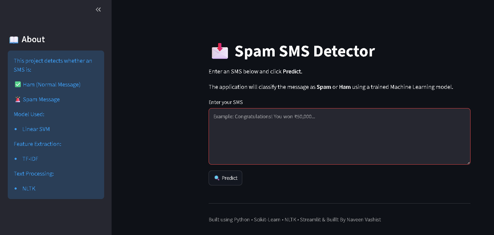
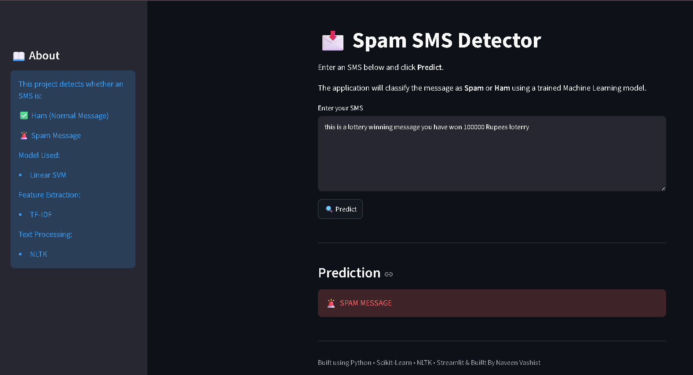
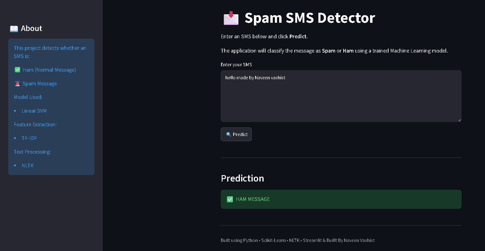

# 📩 Spam SMS Detection using Machine Learning

## 📌 Project Overview

This project detects whether an SMS message is **Spam** or **Ham (Normal Message)** using Machine Learning.

The text messages are preprocessed using **Natural Language Processing (NLP)** techniques and converted into numerical features using **TF-IDF Vectorization** before being classified.

---

## 📂 Dataset

Dataset Used:

SMSSpamCollection

- Total Messages: 5572
- After Removing Duplicates: 5169

Classes:

- Ham (Normal SMS)
- Spam SMS

---

## 🛠 Technologies Used

- Python
- Pandas
- NLTK
- Scikit-Learn
- Streamlit
- Matplotlib

---

## 🔄 Machine Learning Pipeline

Dataset

↓

Data Cleaning

↓

Text Preprocessing

- Lowercase Conversion
- Tokenization
- Stopword Removal
- Stemming

↓

TF-IDF Vectorization

↓

Train/Test Split

↓

Model Training

↓

Prediction

---

## 🤖 Models Compared

| Model | Accuracy |
|--------|----------|
| Naive Bayes | 96.62% |
| Logistic Regression | 95.55% |
| Random Forest | 97.00% |
| **Linear SVM** | **97.49%** ✅ |

Best Model:

**Linear SVM**

---

## 📊 Evaluation Metrics

Accuracy

97.49%

Confusion Matrix

```
[[894   0]
 [ 35 105]]
```

---

## 📸 Screenshots

### Home Page



---

### Spam Prediction



---

### Ham Prediction



---


## ▶️ Run Locally

Clone the repository

```bash
git clone https://github.com/naveenvashist27/Machine-Learning-Projects.git
```

Go inside the project

```bash
cd Machine-Learning-Projects/Spam_Detection
```

Install dependencies

```bash
pip install -r requirements.txt
```

Run the application

```bash
streamlit run app.py
```

---

## 📁 Project Structure

```
Spam_Detection/
│
├── app.py
├── train_model.py
├── predict.py
├── spam_model.pkl
├── vectorizer.pkl
├── requirements.txt
├── SMSSpamCollection
└── screenshots/
```

---

## 👨‍💻 Author

**Naveen Vashist**

GitHub:
https://github.com/naveenvashist27
